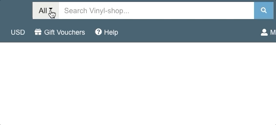
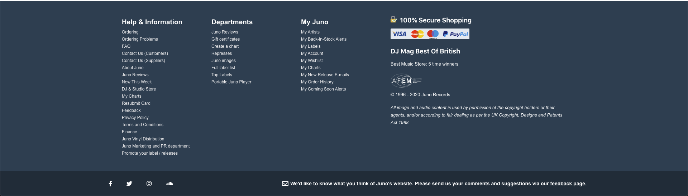

# Vinyl Shop (WIP)

## Motivation

This is a tribute for one of my favorite online record stores, [Juno Records](http://www.juno.co.uk).

I decided to challenge myself to reverse engineer their website with gatsby(react, graphql, nodejs) and without using 3rd party design libraries, only my CSS skills.

## Running the project

1. clone the project
2. run npm i
3. run gatsby develop
4. navigate to localhost:8000

## Screenshots

### Header

### Search + Dropdown

### Footer

